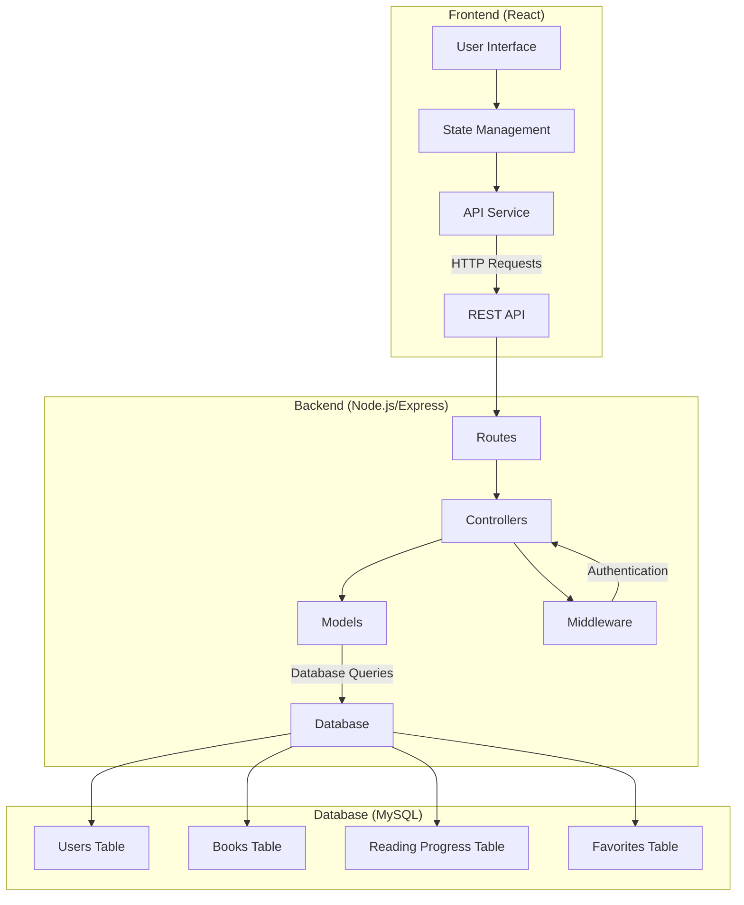
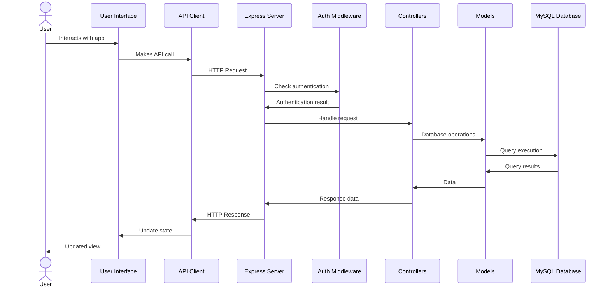
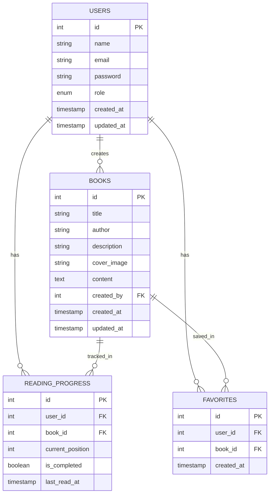
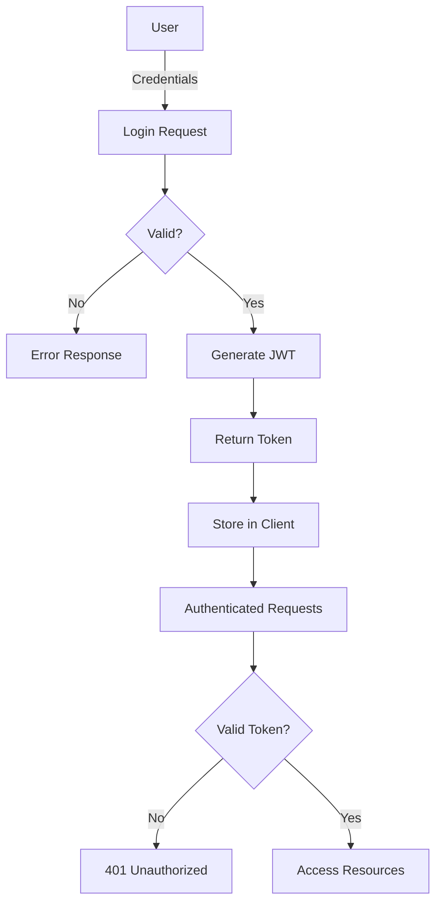
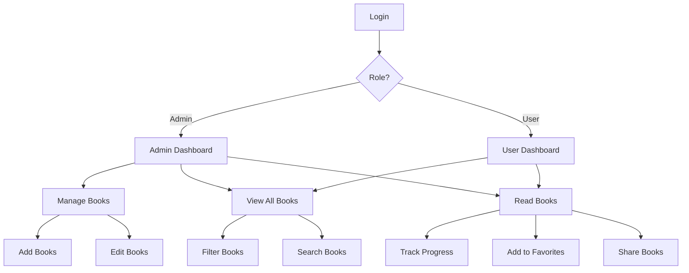
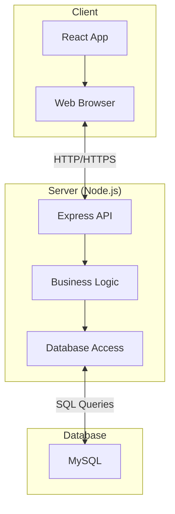

# Scoof Kindle Architecture

This document provides an overview of the Scoof Kindle application architecture.

## System Overview

Scoof Kindle follows a classic three-tier architecture:

1. **Frontend (Client)**: React-based user interface
2. **Backend (Server)**: Node.js/Express API server
3. **Database**: MySQL database for data persistence

## Architecture Diagram

## Component Interaction

## Database Schema

## Authentication Flow

## Admin vs User Flow

## Deployment Architecture

This architecture provides a clear separation of concerns, making the system modular, maintainable, and scalable. 